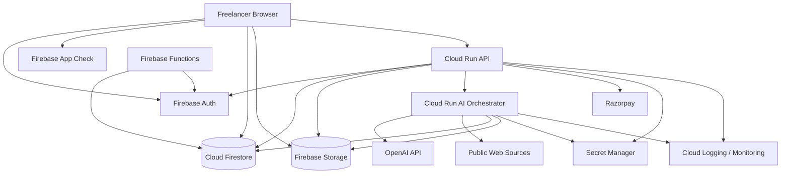
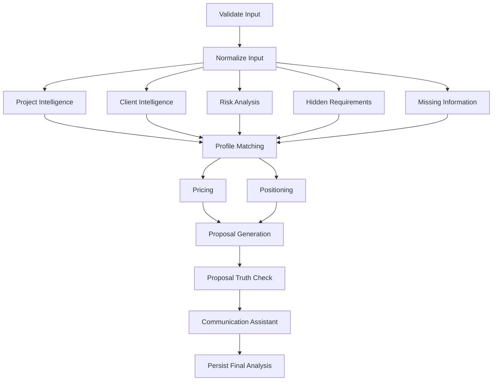
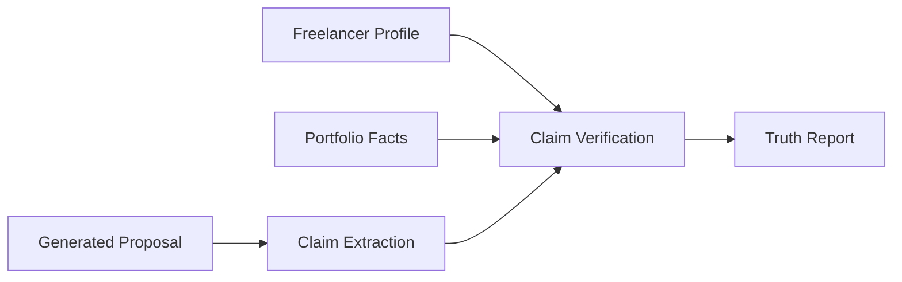
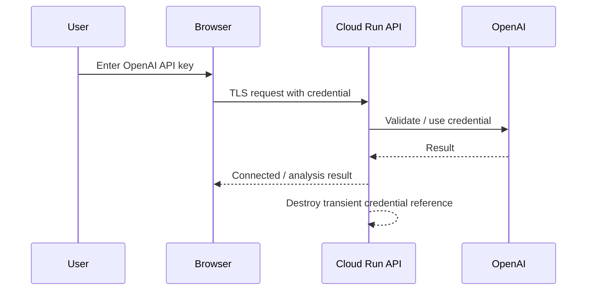
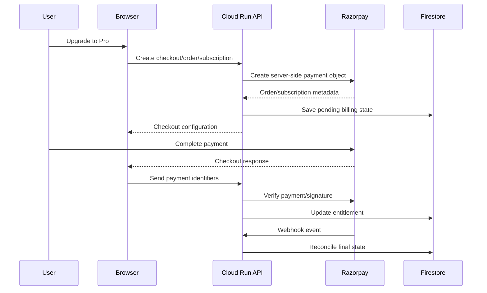
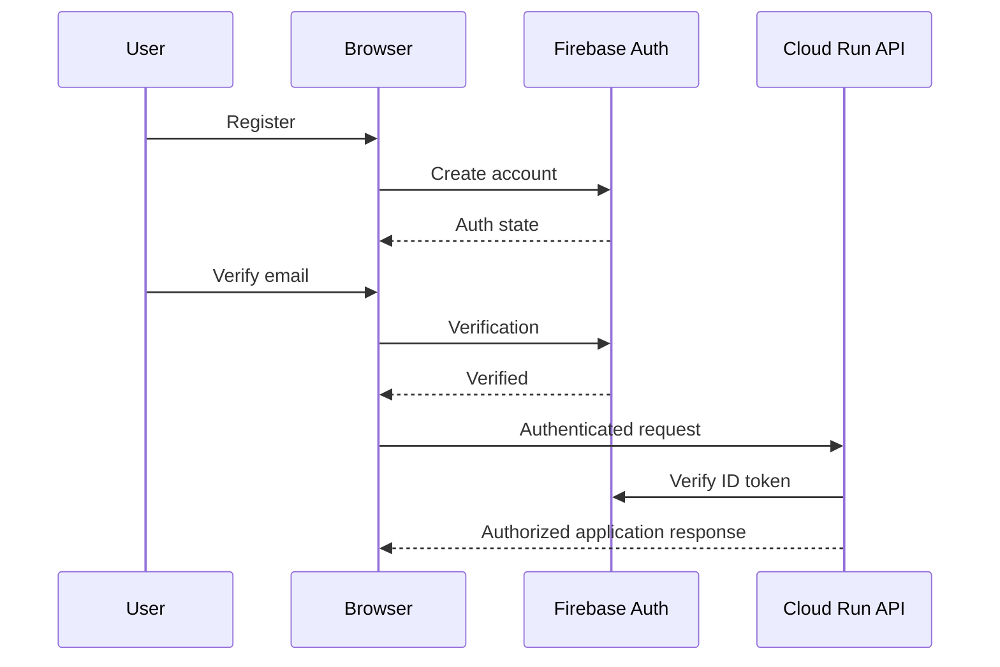
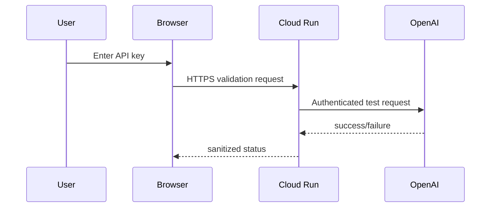
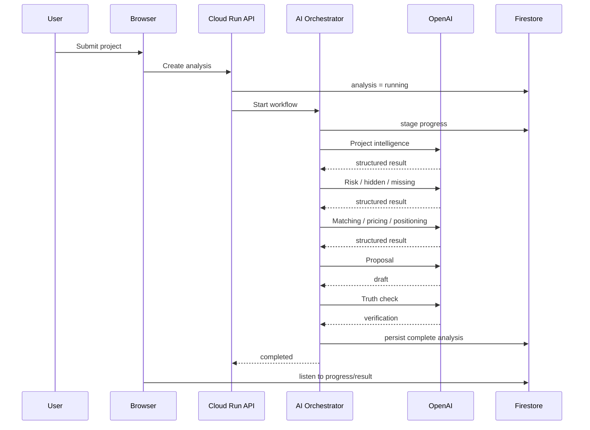

# FreelanceOS — Enterprise Product & System Design

**Document type:** Production SaaS architecture blueprint  
**Product:** Freelance Opportunity Intelligence Platform  
**Primary backend:** Firebase + Google Cloud  
**AI:** OpenAI API via a server-side AI gateway/orchestrator  
**Payments:** Razorpay  
**Design goal:** Secure, scalable, maintainable, developer-friendly implementation without ambiguity

---

## 1. Source of Truth and Scope

This architecture is derived from the attached **FreelanceOS feature specification**. The source defines 31 requested capabilities spanning AI project analysis, project/client intelligence, risk and hidden-requirement detection, matching, pricing, proposal/truth checking, communication assistance, history, freelancer profile, application tracking, dashboard insights, BYOK OpenAI usage, live analysis progress, authentication, Razorpay Pro subscriptions, public/legal/support pages, and responsive UX.  

Source feature baseline:

- Project analyzer accepts pasted descriptions, screenshots, and project URLs.
- Project intelligence includes objective, requirements, deliverables, skills, technologies, experience level, timeline/deadline, budget, urgency, and scope.
- Client intelligence includes public business/company sources, links, and confidence indicators.
- Risk analysis covers suspicious requirements, unclear terms, unrealistic expectations, budget/timeline signals, and red flags.
- Hidden requirements must be separated from confirmed facts as AI inference.
- Missing-information analysis generates specific client questions.
- Matching uses the freelancer profile, skills, experience, technology, and portfolio.
- Pricing and positioning are personalized to the project and freelancer.
- Proposal generation is followed by a truth check against the freelancer's actual profile and portfolio.
- Client communication generation is project-specific.
- Analysis history, saved results, applications, dashboard insights, authentication, BYOK, and Razorpay Pro are required.
- The platform must be responsive across mobile, tablet, and desktop.

No new product feature is silently introduced in this document. Where implementation details are not specified by the source, they are labeled **Architectural Assumption** or **Open Decision**.

---

# 2. Executive Architecture

The platform should be built as a **Firebase-centered SaaS with a privileged Cloud Run API and AI orchestration layer**, not as a browser application that directly calls OpenAI for business operations.

Core principle:

```text
Browser
  -> Firebase Authentication / App Check
  -> API boundary
  -> Domain services
  -> AI orchestration
  -> OpenAI / public-source retrieval
  -> Firestore / Storage
```

The system has six major responsibilities:

1. **Identity and access** — Firebase Authentication + Security Rules + backend authorization.
2. **System of record** — Firestore for tenant-owned business data.
3. **File storage** — Firebase Storage for private screenshots and uploaded assets.
4. **Privileged operations** — Cloud Run API for application/business operations.
5. **AI intelligence** — Cloud Run AI Orchestrator + OpenAI provider adapter.
6. **Billing** — Razorpay checkout, server-side verification, and webhook reconciliation.

The architecture should start as a modular system, not a collection of microservices. Two independently deployable backend services are enough initially:

```text
services/api
services/ai-orchestrator
```

Firebase Functions can handle lightweight event-driven maintenance or triggers, while Cloud Run owns long-running or security-sensitive orchestration.

---

# 3. Product Domains

| Domain | Responsibilities |
|---|---|
| Public | Landing, About, How It Works, Pricing, Privacy, Terms, Contact |
| Identity | Signup, login, verification, session, account lifecycle |
| Profile | Freelancer identity, skills, technologies, experience, portfolio, preferences |
| AI Provider | OpenAI key connection/validation, provider metadata, model configuration |
| Analysis | Project intake, normalization, intelligence pipeline, saved analysis |
| Client Intelligence | Public client/company information and confidence/evidence |
| Matching | Freelancer-to-opportunity fit, dimensions, recommendation |
| Pricing | Quote range, pricing factors, assumptions |
| Positioning | Relevant experience and positioning strategy |
| Proposal | Personalized proposal generation |
| Truth Check | Verification of proposal claims against freelancer facts |
| Communication | Introductions, discovery questions, negotiation, follow-up drafts |
| Applications | Pipeline, notes, replies, follow-ups, outcomes |
| Dashboard | Activity, counts, funnel, performance metrics |
| Billing | Pro subscription, Razorpay state, entitlement |
| Platform | Audit, usage, abuse protection, observability |

---

# 4. Actors and System Boundaries

## 4.1 Actors

### Freelancer

Primary human user. Owns an account/workspace, profile, analyses, applications, and billing state.

### Platform Administrator

Internal operational actor. May investigate support issues, billing failures, abuse, and system health. This role is not required for the first user-facing release but should exist as an authorization boundary.

### AI Orchestrator

Internal backend actor. Runs analysis stages, calls OpenAI, validates outputs, writes progress, and persists trusted results.

### Razorpay

External payment provider. Creates/orders/subscriptions as configured, reports payment events, and supplies webhook events.

### OpenAI

External model provider used by the intelligence layer.

### Public Web Sources

External sources used only where the product legitimately needs public client/company information or URL content.

---

# 5. Multi-Tenancy Strategy

Although the current product is primarily an individual-freelancer application, every business record should be account-scoped from the beginning.

```text
Firebase UID
    |
    v
Account / Workspace
    |
    +-- Membership
    +-- Freelancer Profile
    +-- Analyses
    +-- Applications
    +-- Billing
    +-- Usage
    +-- Files
```

### MVP tenancy model

```text
1 Firebase user
  -> 1 account
  -> 1 owner membership
```

### Enterprise-ready model

```text
Account
  +-- owner
  +-- admin
  +-- member
  +-- viewer
```

This keeps the data model ready for future team/collaboration functionality without claiming that collaboration is a current product requirement.

---

# 6. Product Architecture Diagram



---

# 7. Trust Boundaries

The system has four important trust zones:

```text
ZONE A — Untrusted Client Input
  project text
  screenshots
  URLs
  user-authored notes

ZONE B — Authenticated Application
  Firebase identity
  account membership
  profile
  saved business data

ZONE C — Privileged Backend
  Cloud Run API
  AI Orchestrator
  billing verification
  server-side Firestore writes

ZONE D — External Providers
  OpenAI
  Razorpay
  public web sources
```

Never let data from Zone A directly control privileged behavior in Zone C.

---

# 8. Frontend Architecture

**Architectural Assumption:** React/Next.js + TypeScript is used for the web client because the product is browser-first and needs responsive authenticated routes. If the team uses a different frontend framework, the domain and backend boundaries remain unchanged.

Recommended route structure:

```text
/
├── about
├── how-it-works
├── pricing
├── privacy
├── terms
├── contact
│
├── auth
│   ├── login
│   ├── register
│   ├── verify-email
│   └── forgot-password
│
└── app
    ├── dashboard
    ├── analyze
    ├── history
    │   └── [analysisId]
    ├── applications
    │   └── [applicationId]
    ├── profile
    └── settings
        ├── ai
        ├── account
        └── billing
```

The browser should contain:

- presentation
- local UI state
- Firebase client SDK usage where appropriate
- API client code
- input validation
- feature-specific hooks

The browser should **not** contain:

- OpenAI server credentials
- Razorpay secret material
- Firebase Admin SDK credentials
- privileged Firestore operations
- final authorization decisions
- payment entitlement activation logic

---

# 9. UX Architecture

## 9.1 Dashboard

The dashboard should answer, in order:

1. What have I analyzed?
2. Which opportunities appear relevant?
3. What applications are active?
4. What are my current outcomes?

Suggested information hierarchy:

```text
Overview
  -> Analyzed
  -> Good Matches
  -> Applications
  -> Hired

Pipeline
  -> New
  -> Analyzed
  -> Good Match
  -> Applied
  -> Client Replied
  -> Hired / Rejected

Performance
  -> Match Rate
  -> Application Rate
  -> Reply Rate
  -> Hire Rate
```

## 9.2 Analyze Project

Three supported input modes:

```text
Text
  |
Screenshot/Image ----> Validate ----> Start Analysis
  |
URL
```

Live progress should render the intelligence pipeline instead of a generic spinner.

```text
✓ Project received
✓ Requirements extracted
✓ Technology identified
● Client intelligence
○ Risk analysis
○ Hidden requirements
○ Missing information
○ Profile matching
○ Pricing
○ Positioning
○ Proposal
○ Truth check
```

The source explicitly requires a live staged analysis experience.

## 9.3 Analysis Result

The result should distinguish:

```text
CONFIRMED
AI INFERENCE
UNKNOWN / MISSING
```

This is a product trust mechanism, not just a visual detail.

---

# 10. Core Analysis Pipeline

The analysis engine should be a typed workflow, not one giant prompt.



### Parallelism

After normalization, the first five intelligence stages can run independently. Matching begins when their required inputs are available. Pricing and positioning then become downstream tasks.

### Stage contract

Every stage must define:

```text
Input contract
Output schema
Prompt version
Model configuration
Timeout
Retry policy
Validation
Persistence target
Progress state
Failure type
```

---

# 11. Analysis State Machine

```text
CREATED
  -> VALIDATING
  -> NORMALIZING
  -> ANALYZING
      -> PROJECT
      -> CLIENT
      -> RISK
      -> HIDDEN
      -> MISSING
  -> MATCHING
  -> PRICING
  -> POSITIONING
  -> PROPOSAL
  -> TRUTH_CHECK
  -> FINALIZING
  -> COMPLETED
```

Failure path:

```text
ANY STAGE
  -> FAILED
      -> RETRYABLE
      -> PERMANENT
```

The system should persist stage-level state so one partial failure does not erase the entire analysis.

---

# 12. Canonical Analysis Contract

```typescript
interface Analysis {
  id: string;
  accountId: string;

  input: {
    type: "text" | "image" | "url";
    sourceFileId?: string;
    sourceUrl?: string;
    contentHash?: string;
  };

  project: ProjectIntelligence;
  client: ClientIntelligence;
  risks: RiskAnalysis;
  hiddenRequirements: HiddenRequirement[];
  missingInformation: MissingInformation[];

  matching: MatchAnalysis;
  pricing: PricingAnalysis;
  positioning: PositioningStrategy;

  recommendation: Recommendation;

  proposal?: Proposal;
  truthCheck?: ProposalTruthCheck;
  communication?: CommunicationPack;

  status: AnalysisStatus;

  profileVersion: number;
  promptSetVersion: string;
  modelConfigurationVersion: string;

  createdAt: Timestamp;
  completedAt?: Timestamp;
}
```

The `profileVersion` is important. If a freelancer changes their profile later, historical analyses remain reproducible against the profile version actually used when they were generated.

---

# 13. Evidence Model

Every material AI claim should carry an evidence type.

```typescript
interface IntelligenceClaim<T = string> {
  value: T;
  evidenceType: "confirmed" | "inferred" | "unknown";
  confidence: number;
  evidence?: {
    sourceType:
      | "project_text"
      | "image"
      | "url"
      | "client_source"
      | "freelancer_profile";
    sourceReference?: string;
  };
}
```

Example:

```json
{
  "value": "Client may expect post-launch maintenance",
  "evidenceType": "inferred",
  "confidence": 0.73,
  "evidence": {
    "sourceType": "project_text",
    "sourceReference": "paragraph-4"
  }
}
```

The UI should visibly separate confirmed facts from AI inference.

---

# 14. Project Intelligence Schema

```typescript
interface ProjectIntelligence {
  title?: string;
  objective: string;
  requirements: Requirement[];
  deliverables: string[];
  skills: string[];
  technologies: string[];
  techStack: string[];

  experienceLevel:
    | "beginner"
    | "intermediate"
    | "advanced"
    | "expert"
    | "unknown";

  timeline?: {
    start?: string;
    duration?: string;
    deadline?: string;
  };

  budget?: {
    min?: number;
    max?: number;
    currency?: string;
    confidence: number;
  };

  urgency:
    | "low"
    | "normal"
    | "high"
    | "urgent"
    | "unknown";

  scope:
    | "small"
    | "medium"
    | "large"
    | "enterprise"
    | "unknown";
}
```

---

# 15. Client Intelligence

Client intelligence must be source-oriented.

```typescript
interface ClientSource {
  type:
    | "website"
    | "business_profile"
    | "professional_profile"
    | "public_contact"
    | "other";

  title: string;
  url: string;
  sourceDate?: string;
  confidence: number;
  claims: string[];
}
```

Recommended pipeline:

```text
User URL / Client Clue
  -> URL normalization
  -> safe fetch
  -> content extraction
  -> source normalization
  -> evidence extraction
  -> client intelligence
```

Do not implement private-account scraping or login bypasses as part of this architecture.

---

# 16. URL Fetching and SSRF Protection

Project URLs are attacker-controlled input. The fetch service must not allow a user to use the platform to reach internal systems.

Minimum protections:

- only `http` and `https`
- block loopback and private-network destinations
- re-check destination after redirects
- limit redirects
- limit response size
- limit response time
- enforce MIME-type allowlist
- reject unsupported protocols
- limit decompression size
- prevent DNS rebinding where feasible
- isolate fetching from sensitive internal network resources

Flow:

```text
Browser URL
  -> validation
  -> DNS/target validation
  -> secure fetch
  -> size/MIME/redirect checks
  -> extraction
  -> AI
```

---

# 17. Freelancer Profile as Canonical Truth

The profile is the canonical source for statements about the freelancer.

```text
FreelancerProfile
├── identity
├── skills
├── technologies
├── experience
├── qualifications
├── certifications
├── industries
├── preferredProjectTypes
├── portfolio
├── previousProjects
└── minimumBudget
```

This profile becomes input to:

```text
matching
pricing
positioning
proposal
truth checking
client communication
```

---

# 18. Matching Architecture

Never treat a single model-generated score as an unexplained black box.

```typescript
interface MatchAnalysis {
  overallScore: number;
  skillMatch: MatchDimension;
  experienceMatch: MatchDimension;
  portfolioMatch: MatchDimension;
  difficultyFit: MatchDimension;
  budgetFit: MatchDimension;
  technologyMatch: MatchDimension;
  strengths: string[];
  gaps: string[];
  recommendation: "apply" | "maybe" | "dont_apply";
  reasons: string[];
}

interface MatchDimension {
  score: number;
  explanation: string;
  evidence: string[];
}
```

The UI should explain each dimension rather than displaying only a number.

---

# 19. Pricing Intelligence

Pricing inputs:

```text
scope
requirements
complexity
timeline
client budget
technology
experience
freelancer positioning
```

Output:

```typescript
interface PricingAnalysis {
  suggestedRange: {
    min: number;
    max: number;
    currency: string;
  };
  recommendedQuote?: number;
  complexity: "low" | "medium" | "high" | "very_high";
  factors: PricingFactor[];
  assumptions: string[];
  risks: string[];
}
```

Pricing guidance should be explainable and assumption-aware, not presented as an objectively correct price.

---

# 20. Proposal Architecture

Proposal generation receives:

```text
Project requirements
+
Freelancer profile
+
Relevant portfolio
+
Positioning strategy
+
Pricing context when appropriate
```

The proposal subsystem should not invent background facts.

---

# 21. Proposal Truth Checker



```typescript
interface ProposalTruthCheck {
  passed: boolean;
  claims: {
    text: string;
    status: "verified" | "unsupported" | "contradicted";
    source?: string;
  }[];
  issues: string[];
}
```

A proposal should not be considered publish-ready merely because the proposal model completed successfully.

---

# 22. Client Communication Assistant

Generated communication should be grounded in the analyzed project and freelancer profile.

Supported artifact types from the product specification:

```text
introduction
client message
discovery-call questions
negotiation response
follow-up message
```

All communication outputs should be stored with:

- analysis ID
- application ID when applicable
- communication type
- prompt version
- creation timestamp
- draft status

---

# 23. OpenAI Integration Architecture

The application must use an internal provider abstraction.

```typescript
interface AIProvider {
  analyzeProject(input: ProjectAIInput): Promise<ProjectIntelligence>;
  analyzeClient(input: ClientAIInput): Promise<ClientIntelligence>;
  analyzeRisks(input: RiskAIInput): Promise<RiskAnalysis>;
  analyzeHiddenRequirements(input: HiddenAIInput): Promise<HiddenRequirement[]>;
  identifyMissingInformation(input: MissingAIInput): Promise<MissingInformation[]>;
  matchProfile(input: MatchAIInput): Promise<MatchAnalysis>;
  generatePricing(input: PricingAIInput): Promise<PricingAnalysis>;
  generatePositioning(input: PositioningAIInput): Promise<PositioningStrategy>;
  generateProposal(input: ProposalAIInput): Promise<Proposal>;
  verifyProposal(input: TruthCheckAIInput): Promise<ProposalTruthCheck>;
  generateCommunication(input: CommunicationAIInput): Promise<CommunicationPack>;
}
```

Only the provider adapter understands OpenAI SDK details.

---

# 24. OpenAI API Boundary

OpenAI's current API documentation explicitly treats API keys as secrets and says they should not be exposed in client-side code. It also documents the Responses API for text and image inputs, and supports Structured Outputs for schema-constrained output. The architecture therefore keeps OpenAI calls behind Cloud Run. 

```text
Frontend
   -> Cloud Run API
      -> AI Orchestrator
         -> OpenAI Provider
            -> OpenAI Responses API
```

Do not put OpenAI business logic in React components or Firebase client code.

Current OpenAI documentation also notes that model behavior can vary and recommends pinned model versions plus evals when consistent behavior matters. 

---

# 25. BYOK Architecture

The source requirement says the connected user's API key should be used for the complete analysis workflow.

**Recommended secure model:** accept the user's key through an authenticated HTTPS request and use it only in transient backend memory for the analysis/session. Do not persist the raw key in Firestore, Storage, analytics, logs, URLs, or client persistence.



Persist only non-secret metadata:

```json
{
  "provider": "openai",
  "status": "connected",
  "lastValidatedAt": "timestamp",
  "validationStatus": "success"
}
```

Do not persist:

```json
{
  "apiKey": "sk-..."
}
```

### Important product/open-security decision

If the product eventually needs background analysis after the browser disconnects, a transient BYOK model alone is not enough. The team would then need a separately approved encrypted credential strategy, such as application-managed encrypted storage backed by a dedicated secrets service, plus key rotation/revocation semantics. Do **not** implement that silently.

---

# 26. API Key Validation

```text
User enters key
  -> HTTPS
  -> backend validation request
  -> OpenAI
  -> success/failure
  -> return only sanitized status
```

Do not echo the key back to the client.

Do not log request bodies containing the credential.

Do not store the credential in client localStorage.

---

# 27. OpenAI Structured Outputs

For application-consumed AI results, prefer schema-constrained outputs instead of parsing arbitrary prose.

Example conceptual output contract:

```json
{
  "objective": "string",
  "requirements": [],
  "skills": [],
  "technologies": [],
  "budget": {
    "min": 0,
    "max": 0,
    "currency": "USD"
  }
}
```

Then validate twice:

```text
OpenAI structured output
  -> JSON schema validation
  -> domain validation
  -> persistence
```

A schema-valid response is not automatically a domain-valid response. For example, a `confidence` value should still be checked for the allowed range.

---

# 28. Prompt Architecture

Prompt definitions must be versioned and stored in source control.

```text
prompts/
├── project-intelligence/
│   ├── v1/
│   │   ├── system.md
│   │   ├── schema.json
│   │   └── examples.json
│   └── v2/
├── client-intelligence/
├── risk-analysis/
├── hidden-requirements/
├── missing-information/
├── matching/
├── pricing/
├── positioning/
├── proposal/
├── truth-check/
└── communication/
```

A production prompt version becomes immutable. Changes create a new version.

---

# 29. Model Configuration

Centralize model configuration:

```typescript
const AI_TASKS = {
  PROJECT_ANALYSIS: "configured-model",
  CLIENT_ANALYSIS: "configured-model",
  RISK_ANALYSIS: "configured-model",
  MATCHING: "configured-model",
  PROPOSAL: "configured-model",
  TRUTH_CHECK: "configured-model"
};
```

Do not scatter model IDs throughout the repository.

OpenAI documentation notes that model snapshots can produce different prompting behavior over time; use pinned model versions where reproducibility matters and run regression evals before changing versions.

---

# 30. Retry and Error Policy

Retry only failures that are plausibly transient.

```text
RETRY
  429 / rate limit
  5xx
  transient network failure
  temporary timeout

DO NOT BLINDLY RETRY
  invalid request
  invalid credential
  exhausted quota/billing
  invalid schema/configuration
  permanent content/tool failure
```

Use bounded exponential backoff with jitter and a maximum attempt count.

Do not create duplicate retry loops in both the API controller and provider adapter.

---

# 31. Prompt Injection Defense

Project descriptions, URLs, screenshots, and client-provided content are **untrusted data**.

System/developer instructions must remain separate from user content.

```text
SYSTEM / DEVELOPER INSTRUCTIONS
        +
UNTRUSTED PROJECT CONTENT
        |
        v
       MODEL
```

Never let project text dynamically replace or override the system/developer policy layer.

---

# 32. AI Usage Tracking

```typescript
interface AIUsageRecord {
  accountId: string;
  analysisId: string;
  provider: "openai";
  task: string;
  model: string;
  inputTokens?: number;
  outputTokens?: number;
  totalTokens?: number;
  latencyMs: number;
  success: boolean;
  errorType?: string;
  createdAt: Timestamp;
}
```

This is operational metadata, not a place to store credentials.

---

# 33. AI Cost and Abuse Controls

Even when BYOK is used, the platform needs abuse controls:

- maximum input size
- maximum image size
- maximum URL response size
- analysis timeout
- concurrent analysis limit per account
- request rate limit
- retry cap
- duplicate-content detection
- maximum workflow depth
- stage execution timeout
- account-level temporary lockout after abusive behavior

For duplicate-content detection:

```text
normalized project input
  -> SHA-256 contentHash
  -> compare against same account
```

Cache/reuse should only occur when all material assumptions are compatible, including profile version and prompt version.

---

# 34. Firebase Authentication

Authentication should cover:

```text
register
verify email
login
logout
password recovery
session restoration
account disable/deletion
```

Use Firebase Authentication as the identity provider.

The browser receives Firebase ID tokens; private backend APIs validate the token server-side.

---

# 35. Authorization Model

Authentication is not authorization.

Authorization flow:

```text
Firebase UID
  -> Account membership
  -> Role / permission
  -> Resource accountId
  -> allow / deny
```

MVP role:

```text
owner
```

Future-ready roles:

```text
owner
admin
member
viewer
```

Use Firestore Security Rules for direct client access and IAM for server-side Admin SDK access. Firebase documents that server client libraries bypass Firestore Rules and therefore must be controlled through IAM.

---

# 36. Firebase App Check

Use Firebase App Check for supported Firebase resources and appropriate custom backend protection. For web, use a supported App Check provider appropriate to the deployed architecture.

App Check is an additional abuse-control layer. It is not a replacement for authentication or authorization.

---

# 37. Firestore Data Model

Recommended structure:

```text
/users/{uid}

/accounts/{accountId}
  /members/{uid}
  /profile/main
  /analyses/{analysisId}
    /stages/{stageId}
    /sources/{sourceId}
    /files/{fileId}
    /proposal/{proposalId}
    /truthChecks/{truthCheckId}
    /communications/{communicationId}
  /applications/{applicationId}
    /notes/{noteId}
    /followUps/{followUpId}
    /responses/{responseId}
  /activities/{activityId}
  /usage/{usageId}
  /billing/subscription
  /settings/main

/platformPaymentEvents/{eventId}
/platformAuditLogs/{auditId}
/platformJobs/{jobId}
```

The account path is the fundamental tenant boundary.

---

# 38. User Document

```json
{
  "uid": "firebaseUid",
  "email": "user@example.com",
  "emailVerified": true,
  "displayName": "Freelancer Name",
  "createdAt": "timestamp",
  "updatedAt": "timestamp"
}
```

Identity fields should remain separate from product/business records where practical.

---

# 39. Account Document

```json
{
  "accountId": "acc_123",
  "ownerUid": "uid_123",
  "type": "freelancer",
  "status": "active",
  "createdAt": "timestamp",
  "updatedAt": "timestamp"
}
```

Subscription state belongs in the billing area rather than being trusted from arbitrary browser writes.

---

# 40. Membership Document

```json
{
  "uid": "uid_123",
  "role": "owner",
  "status": "active",
  "joinedAt": "timestamp"
}
```

---

# 41. Freelancer Profile Document

```json
{
  "displayName": "Jane",
  "headline": "Frontend Developer",
  "skills": ["React", "TypeScript"],
  "technologies": ["Next.js", "Firebase"],
  "experienceYears": 4,
  "qualifications": [],
  "certifications": [],
  "portfolio": [],
  "previousProjects": [],
  "preferredProjectTypes": [],
  "preferredIndustries": [],
  "minimumBudget": {
    "amount": 500,
    "currency": "USD"
  },
  "profileVersion": 7,
  "updatedAt": "timestamp"
}
```

Increment `profileVersion` on each material profile change.

---

# 42. Analysis Metadata

Keep the top-level analysis record compact and queryable.

```json
{
  "accountId": "acc_123",
  "status": "completed",
  "inputType": "url",
  "title": "React SaaS Dashboard",
  "recommendation": "apply",
  "matchScore": 87,
  "budgetMin": 1200,
  "budgetMax": 1800,
  "currency": "USD",
  "profileVersion": 7,
  "promptSetVersion": "analysis-v3",
  "modelConfigurationVersion": "models-v2",
  "createdAt": "timestamp",
  "completedAt": "timestamp"
}
```

Large model outputs should be split into subcollections or separate documents to avoid oversized Firestore documents and to make partial failure/recovery easier.

---

# 43. Analysis Stage Record

```json
{
  "stage": "project_intelligence",
  "status": "completed",
  "attempts": 1,
  "startedAt": "timestamp",
  "completedAt": "timestamp",
  "resultRef": "analyses/an_123/stages/project_intelligence/result",
  "model": "configured-model",
  "latencyMs": 4200
}
```

The result payload itself can live as a separate stage document.

---

# 44. Application Model

The application tracker is a lifecycle around an analyzed opportunity.

```json
{
  "id": "app_123",
  "analysisId": "an_123",
  "accountId": "acc_123",
  "clientName": "Example Client",
  "projectTitle": "React Dashboard",
  "stage": "applied",
  "appliedAt": "timestamp",
  "outcome": null,
  "createdAt": "timestamp",
  "updatedAt": "timestamp"
}
```

Stages required by the source:

```text
new
analyzed
good_match
applied
client_replied
hired
rejected
```

Use subcollections for notes, follow-ups, and response history when those records become numerous or need independent querying.

---

# 45. Dashboard Summary

Avoid recomputing every metric by scanning an account's entire history on every dashboard load.

Use a maintained summary document:

```text
/accounts/{accountId}/dashboard/summary
```

```json
{
  "projectsAnalyzed": 125,
  "goodMatches": 47,
  "applications": 31,
  "clientReplies": 12,
  "hired": 3,
  "rejected": 14,
  "updatedAt": "timestamp"
}
```

Summary updates should be generated from trusted domain events, not arbitrary client updates.

---

# 46. Activity Model

```json
{
  "type": "application_stage_changed",
  "entityType": "application",
  "entityId": "app_123",
  "metadata": {
    "from": "applied",
    "to": "client_replied"
  },
  "createdAt": "timestamp"
}
```

Example activity types:

```text
analysis_created
analysis_completed
application_created
application_stage_changed
proposal_generated
client_replied
application_hired
application_rejected
```

---

# 47. Billing Data Model

```text
/accounts/{accountId}/billing/subscription
```

```json
{
  "provider": "razorpay",
  "planId": "plan_xxx",
  "subscriptionId": "sub_xxx",
  "status": "active",
  "currentPeriodStart": "timestamp",
  "currentPeriodEnd": "timestamp",
  "cancelAtPeriodEnd": false,
  "updatedAt": "timestamp"
}
```

The client must never authoritatively write `status: active`.

---

# 48. Firebase Storage Model

Private asset layout:

```text
accounts/{accountId}/
  analyses/{analysisId}/
    inputs/{fileId}
```

Typical inputs:

- screenshots
- supported uploaded files
- analysis-specific source artifacts where the product requires retention

Validate content type, size, ownership, and path authorization.

---

# 49. Firestore Security Rules Strategy

Firebase's documented security model uses Authentication + Firestore Security Rules for browser/client access, while server SDKs use IAM. Firebase also explicitly states that Security Rules are not filters, so queries must already be constrained to authorized data.

Conceptual structure:

```javascript
function signedIn() {
  return request.auth != null;
}

function memberOf(accountId) {
  return signedIn() && exists(
    /databases/$(database)/documents/accounts/$(accountId)/members/$(request.auth.uid)
  );
}

match /accounts/{accountId}/profile/{docId} {
  allow read, write: if memberOf(accountId);
}

match /accounts/{accountId}/analyses/{analysisId} {
  allow read: if memberOf(accountId);
  allow write: if false;
}

match /accounts/{accountId}/applications/{applicationId} {
  allow read, write: if memberOf(accountId);
}

match /accounts/{accountId}/billing/{document=**} {
  allow read: if memberOf(accountId);
  allow write: if false;
}
```

AI result writes, payment state writes, usage writes, and platform audit writes should be server-owned.

---

# 50. Firestore Rule Engineering Rules

Rules should be authored at the same time as each data path is introduced. Firebase recommends treating rules as part of the data schema and testing them through the Local Emulator Suite.

Required CI security tests:

```text
owner can read own data
owner cannot read other account
owner cannot change server-owned fields
unauthenticated access rejected
malformed writes rejected
billing client writes rejected
platform audit client writes rejected
```

---

# 51. API Surface

Recommended endpoints:

```text
POST   /v1/ai-key/validate

POST   /v1/analyses
GET    /v1/analyses/:analysisId
DELETE /v1/analyses/:analysisId

POST   /v1/analyses/:analysisId/proposal
POST   /v1/analyses/:analysisId/truth-check
POST   /v1/analyses/:analysisId/communication

GET    /v1/profile
PATCH  /v1/profile

GET    /v1/applications
POST   /v1/applications
GET    /v1/applications/:applicationId
PATCH  /v1/applications/:applicationId

GET    /v1/dashboard/summary

POST   /v1/billing/checkout
POST   /v1/billing/verify
POST   /v1/webhooks/razorpay
```

The final API contract should be represented in OpenAPI and generated/shared types where practical.

---

# 52. API Authentication and Request Security

Private endpoints require:

```text
Firebase ID Token
+
App Check where supported/appropriate
+
account authorization
+
rate limit
+
request validation
```

Example:

```http
Authorization: Bearer <Firebase ID Token>
X-Firebase-AppCheck: <AppCheck Token>
```

Never log authentication headers.

---

# 53. Create Analysis API Contract

Request:

```json
{
  "input": {
    "type": "text",
    "text": "Need React developer for a SaaS dashboard..."
  }
}
```

For an image:

```json
{
  "input": {
    "type": "image",
    "storagePath": "accounts/acc_123/analyses/an_123/inputs/file_1.png"
  }
}
```

For a URL:

```json
{
  "input": {
    "type": "url",
    "url": "https://example.com/project"
  }
}
```

Response:

```json
{
  "analysisId": "an_123",
  "status": "running"
}
```

Use Firestore progress listeners for the live UX.

---

# 54. Live Progress Architecture

Recommended initial implementation:

```text
Cloud Run AI Orchestrator
    -> writes analysis progress document
    -> Firestore listener
    -> browser UI
```

Example:

```json
{
  "status": "running",
  "currentStage": "pricing",
  "progress": 68,
  "stages": {
    "project": "completed",
    "client": "completed",
    "risk": "completed",
    "hidden": "completed",
    "missing": "completed",
    "matching": "completed",
    "pricing": "running",
    "positioning": "pending",
    "proposal": "pending",
    "truthCheck": "pending"
  },
  "updatedAt": "timestamp"
}
```

This avoids building a custom WebSocket infrastructure for the MVP.

---

# 55. Asynchronous Execution Evolution

For low/medium initial traffic:

```text
API -> AI Orchestrator -> Firestore progress
```

At higher scale or when execution limits become restrictive:

```text
API
  -> Cloud Tasks / Pub/Sub
  -> AI Worker
  -> stage execution
  -> Firestore
```

The product contract should remain the same regardless of worker topology.

---

# 56. Razorpay Architecture

Payment state must be server authoritative.



Razorpay documentation distinguishes the client-side callback result from server-to-server webhooks and recommends webhooks for server-side event tracking. Webhooks must therefore be treated as a core reconciliation mechanism, not as a UI-only callback.

---

# 57. Razorpay Idempotency

Persist processed webhook/event identifiers:

```text
/platformPaymentEvents/{eventId}
```

```json
{
  "eventId": "evt_xxx",
  "type": "subscription.activated",
  "processedAt": "timestamp"
}
```

Processing rule:

```text
Webhook received
  -> event already processed?
       yes -> ignore safely
       no  -> process -> persist event ID
```

---

# 58. Entitlement Model

Keep product entitlement distinct from payment events.

```text
Razorpay
  -> verified payment state
  -> account billing state
  -> entitlement decision
  -> product access
```

Example:

```json
{
  "plan": "pro",
  "entitlement": "active",
  "source": "razorpay",
  "validUntil": "timestamp"
}
```

The browser may display this state but must not define it.

---

# 59. Secrets Management

Platform-owned secrets:

```text
Razorpay secrets
platform OpenAI key if a managed mode is added
webhook signing secrets
third-party credentials
service configuration secrets
```

Store these in Google Secret Manager / equivalent managed secret storage.

Do not put them in:

- Git
- `.env` committed to source control
- Firestore
- frontend bundles
- client-side local storage
- Cloud Logging

Firebase documentation also distinguishes non-secret Firebase API configuration from truly sensitive credentials such as service-account private keys.

---

# 60. Data Protection

Required baseline controls:

```text
TLS in transit
encryption at rest via managed cloud services
least-privilege IAM
account-scoped access
private Storage paths
data retention rules
account deletion
log redaction
secure secrets
security testing
```

Define retention periods separately for:

```text
analysis records
uploaded screenshots
AI usage metadata
application history
audit logs
payment records
```

Do not invent a legal retention period until the product/legal owner approves it.

---

# 61. Account Deletion Lifecycle

```text
DELETE REQUEST
  -> deletion_pending
  -> disable application access
  -> delete private files
  -> delete account-owned Firestore records
  -> revoke billing entitlement
  -> delete identity
  -> preserve only legally required records
```

Use asynchronous cleanup for large account trees rather than one synchronous request.

The exact retention exception list is an **Open Decision**.

---

# 62. Audit Logging

Recommended events:

```text
account.created
profile.updated
analysis.created
analysis.completed
analysis.failed
proposal.generated
truth_check.completed
application.created
application.stage_changed
billing.checkout_created
billing.payment_verified
subscription.activated
subscription.cancelled
account.deletion_requested
account.deleted
admin.account_accessed
```

Audit logs must never contain raw OpenAI keys, raw authorization headers, or other credential material.

---

# 63. Observability

Track at minimum:

```text
API latency
analysis completion rate
stage failure rate
OpenAI error rate
OpenAI 429 rate
URL fetch failures
Storage failures
Firestore failures
auth failures
Razorpay verification failures
webhook failures
```

Suggested operational dashboards:

```text
System Health
AI Health
Billing Health
Security Health
Usage / Abuse
```

Use correlation IDs across API, orchestration, and database records.

---

# 64. Logging Policy

Never log:

```text
OpenAI API keys
Razorpay secret keys
Firebase service account private keys
Authorization headers
raw sensitive payment credentials
full request bodies containing secrets
```

Prefer:

```json
{
  "requestId": "req_123",
  "accountId": "acc_123",
  "analysisId": "an_123",
  "stage": "pricing",
  "durationMs": 2910,
  "success": true
}
```

---

# 65. Rate Limiting and Abuse Prevention

Apply rate limits at multiple levels:

```text
IP / network level
Firebase UID
Account ID
endpoint
analysis job
AI stage
```

Examples of high-risk endpoints:

```text
POST /analyses
POST /ai-key/validate
POST /proposal
POST /communication
POST /billing/checkout
```

Do not let a user launch unlimited simultaneous analyses.

---

# 66. Firestore Index Strategy

Likely indexes:

```text
analyses
  accountId ASC
  createdAt DESC

analyses
  accountId ASC
  recommendation ASC
  createdAt DESC

applications
  accountId ASC
  stage ASC
  updatedAt DESC

applications
  accountId ASC
  updatedAt DESC

activities
  accountId ASC
  createdAt DESC
```

Only add indexes for actual query requirements. Avoid creating unnecessary composite indexes.

---

# 67. Monorepo Folder Structure

```text
freelance-os/
├── apps/
│   └── web/
│       ├── app/
│       ├── components/
│       │   ├── ui/
│       │   ├── layout/
│       │   ├── analysis/
│       │   ├── applications/
│       │   └── dashboard/
│       ├── features/
│       │   ├── auth/
│       │   ├── profile/
│       │   ├── analysis/
│       │   ├── applications/
│       │   ├── billing/
│       │   └── ai-key/
│       ├── hooks/
│       ├── lib/
│       │   ├── firebase/
│       │   ├── api/
│       │   ├── analytics/
│       │   └── validation/
│       ├── state/
│       ├── styles/
│       └── middleware/
│
├── services/
│   ├── api/
│   │   └── src/
│   │       ├── routes/
│   │       ├── middleware/
│   │       ├── controllers/
│   │       ├── services/
│   │       └── server.ts
│   │
│   └── ai-orchestrator/
│       └── src/
│           ├── orchestration/
│           ├── stages/
│           ├── providers/
│           ├── prompts/
│           ├── validators/
│           ├── fetchers/
│           ├── usage/
│           └── server.ts
│
├── functions/
│   └── src/
│       ├── auth/
│       ├── firestore/
│       ├── billing/
│       └── maintenance/
│
├── packages/
│   ├── contracts/
│   ├── domain/
│   ├── firebase/
│   ├── validation/
│   ├── observability/
│   ├── config/
│   └── shared/
│
├── prompts/
├── firebase/
│   ├── firestore.rules
│   ├── firestore.indexes.json
│   ├── storage.rules
│   └── emulators/
├── infra/
│   ├── environments/
│   │   ├── dev/
│   │   ├── staging/
│   │   └── production/
│   └── gcp/
├── tests/
│   ├── unit/
│   ├── integration/
│   ├── security/
│   ├── ai/
│   └── e2e/
├── docs/
│   ├── architecture/
│   ├── api/
│   ├── database/
│   ├── security/
│   └── runbooks/
├── firebase.json
├── package.json
└── README.md
```

---

# 68. Folder Ownership Rules

### `apps/web`

Browser-only concerns.

### `services/api`

Authenticated application APIs, authorization, billing endpoints, and request orchestration.

### `services/ai-orchestrator`

AI pipeline, OpenAI provider adapter, prompt loading, validation, public-source fetching, retries, usage accounting.

### `packages/contracts`

Shared request/response/domain schemas.

### `packages/domain`

Framework-independent business rules.

### `packages/validation`

Zod/JSON Schema or equivalent request/domain validation.

### `packages/firebase`

Firebase client/server initialization, repository abstractions, and persistence adapters.

### `prompts`

Versioned model prompts and output schemas.

---

# 69. Repository Pattern

Frontend and controllers should not contain raw Firestore access everywhere.

Example:

```typescript
interface AnalysisRepository {
  create(input: CreateAnalysisInput): Promise<Analysis>;
  findById(accountId: string, analysisId: string): Promise<Analysis | null>;
  update(accountId: string, analysisId: string, patch: AnalysisPatch): Promise<void>;
  listByAccount(accountId: string, query: AnalysisQuery): Promise<Analysis[]>;
}
```

Implementation:

```text
FirestoreAnalysisRepository
```

This lets domain logic remain independent of Firestore implementation details.

---

# 70. Domain Modules

```text
domain/
├── account/
├── profile/
├── analysis/
├── matching/
├── pricing/
├── proposal/
├── truth-check/
├── application/
├── billing/
├── usage/
└── audit/
```

Each domain should own its entity types, validation, service interfaces, and business invariants.

---

# 71. Authentication Flow



---

# 72. OpenAI Key Connection Flow



Raw credential is never persisted as application data.

---

# 73. Text Analysis Flow



---

# 74. URL Analysis Flow

```text
User URL
  -> authenticated API
  -> URL security validation
  -> safe fetcher
  -> content extraction
  -> project/client evidence
  -> AI pipeline
  -> analysis persistence
```

Do not let arbitrary URLs become a direct proxy into internal resources.

---

# 75. Screenshot Analysis Flow

```text
Browser
  -> Firebase Storage upload
  -> Storage Rules
  -> backend validates file metadata
  -> AI Orchestrator fetches approved asset
  -> OpenAI image-capable request
  -> structured project intelligence
  -> remaining analysis pipeline
```

OpenAI's current API supports image input in the Responses API, including image URLs, file IDs, and base64 data URLs.

---

# 76. Proposal and Truth-Check Flow

```text
Completed analysis
  -> select relevant freelancer profile facts
  -> select relevant portfolio evidence
  -> generate proposal
  -> extract claims
  -> verify claims
  -> mark verified / unsupported / contradicted
  -> save final draft
```

The truth checker is an explicit trust layer, not a cosmetic add-on.

---

# 77. Application Tracking Flow

Analysis
  -> create application
  -> stage = applied
  -> client reply
  -> stage = client_replied
  -> final outcome
  -> hired / rejected
```

Every stage transition can emit an activity record.

---

# 78. Billing Flow

```text
User clicks Pro
  -> backend creates payment object
  -> Razorpay checkout
  -> payment completion
  -> backend verifies signature/payment state
  -> webhook reconciliation
  -> subscription state updated
  -> entitlement becomes active
```

Do not make browser callback success the sole source of truth.

---

# 79. Environment Separation

Use three environments:

```text
development
staging
production
```

Each environment should have separate:

- Firebase project
- Firestore
- Storage
- Cloud Run deployment
- Razorpay mode/configuration
- secrets
- telemetry destination

Never test destructive billing flows against production credentials.

---

# 80. Local Development

Use Firebase Local Emulator Suite for:

```text
Auth
Firestore
Storage
Functions
```

Use mocked/fake adapters for:

```text
OpenAI
Razorpay
external web fetching
```

This allows security and integration tests to run without depending on live third-party services.

---

# 81. CI/CD Pipeline

```text
Pull Request
  -> lint
  -> type check
  -> unit tests
  -> security rule tests
  -> domain tests
  -> AI schema tests
  -> integration tests
  -> build
  -> staging deploy
  -> smoke tests
  -> production approval
  -> production deploy
```

Production deployments should be versioned and reversible.

---

# 82. AI Evaluation Strategy

Do not assert only exact generated text.

Use:

```text
schema tests
semantic assertions
golden datasets
prompt regression tests
truth-check cases
prompt-injection cases
edge-case fixtures
```

Example fixture:

```text
tests/ai/fixtures/
├── simple-project.json
├── ambiguous-project.json
├── low-budget-project.json
├── suspicious-project.json
├── missing-requirements.json
├── screenshot-project.json
├── url-project.json
└── fabricated-portfolio-claim.json
```

A model/version change should run the regression suite before production rollout.

---

# 83. Mobile Architecture

The entire application must be responsive without horizontal overflow.

Desktop can use:

```text
sidebar + main content + contextual panels
```

Mobile should prioritize:

```text
top navigation
stacked content
accordions/drawers where appropriate
sticky primary actions
```

Do not postpone mobile behavior to the end of implementation.

---

# 84. Product State Standards

Every major frontend feature must define:

```text
idle
loading
success
empty
error
```

AI stages additionally use:

```text
queued
running
completed
failed
skipped
```

Payment screens should additionally model:

```text
creating
awaiting_payment
verifying
active
failed
expired
```

---

# 85. Error Taxonomy

Recommended internal errors:

```text
AUTHENTICATION_ERROR
AUTHORIZATION_ERROR

INVALID_PROJECT_INPUT
UNSUPPORTED_FILE_TYPE
FILE_TOO_LARGE
INVALID_URL
URL_FETCH_FAILED
URL_FETCH_BLOCKED
URL_FETCH_TIMEOUT

OPENAI_KEY_INVALID
OPENAI_RATE_LIMIT
OPENAI_QUOTA_EXCEEDED
OPENAI_TIMEOUT
OPENAI_SCHEMA_ERROR

PAYMENT_VERIFICATION_FAILED
SUBSCRIPTION_NOT_ACTIVE

INTERNAL_ERROR
```

Frontend messages should be user-friendly while logs retain diagnostic detail.

---

# 86. MVP vs Enterprise Scope

## MVP functional scope — still includes the requested product

```text
Authentication
Freelancer profile
OpenAI BYOK
Text/image/URL project intake
Project intelligence
Client intelligence
Risk analysis
Hidden requirements
Missing questions
Profile matching
Recommendation
Pricing
Positioning
Proposal generation
Proposal truth checker
Communication assistant
History
Application tracker
Dashboard
Razorpay Pro
Public/legal/support pages
Responsive UX
```

This is not a reduced AI-only MVP; these capabilities are present in the provided source specification.

## Enterprise engineering scope

```text
tenant isolation
App Check
strict IAM
structured AI contracts
prompt versioning
AI evals
security rule tests
audit logging
rate limiting
usage telemetry
secret management
SSRF protection
webhook idempotency
CI/CD
observability
retention/deletion workflows
```

---

# 87. What Not to Overbuild First

Do not begin with:

- microservice-per-feature architecture
- Kubernetes
- multi-region Firestore design
- custom event bus for every domain event
- bespoke WebSocket infrastructure
- fully autonomous agent orchestration

Start with clean boundaries and two main Cloud Run services. Split services only when a real scaling, security, ownership, or deployment need appears.

---

# 88. Scaling Path

### Stage 1

```text
Firebase
Cloud Run API
Cloud Run AI Orchestrator
OpenAI
Razorpay
```

### Stage 2

```text
Cloud Tasks / Pub/Sub
background AI workers
specialized fetch worker
```

### Stage 3

```text
multiple worker pools
advanced analytics pipeline
specialized retrieval/research services
additional AI providers
```

The frontend and domain contracts remain stable.

---

# 89. Configuration Strategy

Centralize application configuration:

```text
APP_ENV
FIREBASE_PROJECT_ID
AI_DEFAULT_PROVIDER
AI_PROJECT_MODEL
AI_PROPOSAL_MODEL
AI_TRUTH_MODEL
AI_MAX_INPUT_SIZE
AI_MAX_IMAGE_SIZE
AI_MAX_ANALYSIS_DURATION
RAZORPAY_KEY_ID
APP_CHECK_ENABLED
RATE_LIMIT_ENABLED
```

Secret values should be injected at runtime from managed secret storage.

Application startup should fail fast if required production configuration is missing.

---

# 90. Documentation Requirements

The repository should ship with:

```text
docs/architecture/overview.md
docs/architecture/analysis-pipeline.md
docs/architecture/security.md
docs/database/firestore-model.md
docs/api/openapi.md
docs/ai/prompt-versioning.md
docs/ai/evals.md
docs/billing/razorpay.md
docs/runbooks/failed-analysis.md
docs/runbooks/payment-failure.md
```

A developer joining the project should be able to answer:

```text
Where does this data live?
Who can read it?
Who can write it?
Which service owns the write?
Which prompt produces it?
How do I test it?
What happens when it fails?
```

---

# 91. Naming Consistency Reference

| Concept | Canonical name |
|---|---|
| Tenant | Account |
| Auth identity | User / Firebase UID |
| Membership | Account Member |
| Main user data | Freelancer Profile |
| Opportunity analysis | Analysis |
| Analysis input | Project Input |
| Analysis task | Stage |
| Opportunity tracking | Application |
| AI model provider | AI Provider |
| Prompt grouping | Prompt Set |
| Prompt release | Prompt Set Version |
| User AI credential | BYOK credential / transient credential |
| Paid access | Entitlement |
| Payment provider | Razorpay |
| AI result confidence | Confidence |
| AI fact classification | Evidence Type |

Avoid using `project`, `opportunity`, `lead`, and `analysis` interchangeably in code. A single canonical vocabulary is important for team consistency.

---

# 92. Open Decisions

These are not defined by the attached source and must be decided explicitly.

## Billing

- What exactly does Pro unlock?
- Monthly, annual, or another billing interval?
- Are there usage limits on Pro?
- Are refunds supported and how are they handled?

## BYOK lifecycle

- Is transient-use BYOK sufficient for all user workflows?
- Must analysis continue if the browser disconnects?
- Will multiple OpenAI projects/keys be supported?
- Is a platform-managed AI mode ever planned?

## Public-source research

- Which public source categories are supported?
- What crawling/fetching policy is acceptable?
- What is the supported URL content size/time budget?

## Data lifecycle

- Retention period for analyses?
- Retention for screenshots?
- Deletion grace period?
- Audit-log retention?

## Product rules

- Exact matching-score methodology?
- Exact pricing formula vs model-assisted estimate?
- Currency behavior?
- Which profile fields are mandatory?

Do not hide these decisions inside code defaults.

---

# 93. Risks and Mitigations

| Risk | Mitigation |
|---|---|
| OpenAI key leakage | transient BYOK, redaction, no persistence |
| Cross-tenant data leakage | account-scoped paths + Rules + backend auth |
| Unauthorized AI writes | backend-owned result writes |
| Hallucinated freelancer claims | truth-check stage + evidence model |
| Prompt injection | untrusted-content boundaries |
| SSRF | secure URL fetcher |
| Payment spoofing | server verification + webhooks |
| Duplicate webhook handling | event-idempotency |
| AI rate limit failures | bounded backoff and retry classification |
| Large Firestore documents | stage subcollections/documents |
| Dashboard query cost | maintained summary |
| Prompt regressions | versioned prompts + evals |
| Security regressions | emulator-based Rules tests |
| Account deletion complexity | asynchronous cleanup |
| Vendor change | provider abstraction |

---

# 94. Phased Implementation Roadmap

| Phase | Output |
|---|---|
| 0 | Repository, environments, Auth, Firebase, CI/CD, shared contracts |
| 1 | Freelancer Profile |
| 2 | BYOK validation and AI provider abstraction |
| 3 | Text/image/URL project intake |
| 4 | Core intelligence stages |
| 5 | Matching, recommendation, pricing, positioning |
| 6 | Proposal, truth check, communication |
| 7 | History and saved analyses |
| 8 | Application tracker |
| 9 | Dashboard and performance insights |
| 10 | Razorpay Pro billing |
| 11 | Security hardening and operational controls |
| 12 | AI regression/evaluation suite and production-quality polish |

No delivery timeline is assumed because the source does not specify one.

---

# 95. Definition of Done

A feature is complete only when the relevant items below exist:

```text
[ ] UI
[ ] Responsive behavior
[ ] Loading state
[ ] Empty state
[ ] Error state
[ ] Type/schema contract
[ ] Input validation
[ ] Authorization
[ ] Firestore/Storage rules where applicable
[ ] Backend implementation where privileged work exists
[ ] Tests
[ ] Observability
[ ] Audit event where appropriate
[ ] Documentation
```

---

# 96. Final Implementation Checklist

## Product

```text
[ ] Landing
[ ] About
[ ] How It Works
[ ] Pricing
[ ] Privacy
[ ] Terms
[ ] Contact
[ ] Authentication
[ ] Verification
[ ] Freelancer profile
[ ] BYOK
[ ] Text analysis
[ ] Screenshot analysis
[ ] URL analysis
[ ] Project intelligence
[ ] Client intelligence
[ ] Risk analysis
[ ] Hidden requirements
[ ] Missing questions
[ ] Matching
[ ] Recommendation
[ ] Pricing
[ ] Positioning
[ ] Proposal
[ ] Truth checker
[ ] Communication assistant
[ ] History
[ ] Application tracker
[ ] Dashboard
[ ] Razorpay Pro
[ ] Responsive UX
```

## Backend

```text
[ ] Firebase Auth
[ ] Firestore
[ ] Storage
[ ] App Check
[ ] Cloud Run API
[ ] AI Orchestrator
[ ] Functions as needed
[ ] IAM
[ ] Secret Manager
[ ] CI/CD
```

## AI

```text
[ ] Provider abstraction
[ ] Prompt versioning
[ ] Structured outputs
[ ] Domain validation
[ ] Retry policy
[ ] Usage tracking
[ ] Cost/abuse controls
[ ] Prompt injection protection
[ ] Truth-check pipeline
[ ] Golden datasets
[ ] Regression tests
```

## Security

```text
[ ] Tenant isolation
[ ] Firestore Rules
[ ] Storage Rules
[ ] Server authorization
[ ] Rate limiting
[ ] App Check
[ ] SSRF protection
[ ] File validation
[ ] Secret redaction
[ ] Razorpay verification
[ ] Webhook signature verification
[ ] Audit logs
```

## Operations

```text
[ ] Dev Firebase project
[ ] Staging Firebase project
[ ] Production Firebase project
[ ] Monitoring
[ ] Alerts
[ ] Error reporting
[ ] Recovery strategy
[ ] Runbooks
```

---

# 97. Architecture Self-Check

### Can one freelancer access another freelancer's data?

**Design answer: no.** Account-scoped paths and authorization rules prevent cross-tenant access.

### Can the browser modify its own recommendation or score directly?

**Design answer: no.** AI-generated results are server-owned.

### Can an attacker use a guessed analysis ID?

**Design answer: no.** Authorization depends on account membership, not identifier secrecy.

### Can an OpenAI key appear in Firestore?

**Design answer: no under the recommended BYOK mode.** Only non-secret connection metadata is stored.

### Can project text override AI instructions?

**Design answer: no.** Project content is untrusted data, separated from higher-priority instructions.

### Can the proposal invent freelancer experience?

**Design answer: strongly mitigated.** Proposal output passes through a truth-check stage against the canonical profile/portfolio.

### Can a fake payment activate Pro?

**Design answer: no.** Entitlement is updated only after server-side verification/reconciliation.

### Can a URL attack internal services?

**Design answer: not by design.** The fetch layer has SSRF and resource controls.

### Can production prompts change silently?

**Design answer: no.** Prompt versions are explicit and immutable once released.

### Can model changes silently reduce output quality?

**Design answer: minimized.** Model configuration is centralized and evaluated through regression fixtures.

---

# 98. Recommended Developer Mental Model

Every engineer should remember:

```text
Frontend
  = presentation + interaction

Firebase
  = identity + tenant-owned application data

Cloud Run API
  = privileged product operations

AI Orchestrator
  = intelligence workflow

OpenAI
  = model intelligence

Razorpay
  = payment provider

Security Rules + IAM + Backend Authorization
  = access control

Schemas + Prompt Versions + Evals
  = AI software contract
```

And the product's core flow is:

```text
Opportunity
  -> normalized project
  -> project intelligence
  -> client intelligence
  -> risk / hidden / missing
  -> freelancer matching
  -> pricing / positioning
  -> proposal
  -> truth check
  -> application
  -> outcome
  -> performance insights
```

---

# 99. Current Vendor Reference Notes

These references were used only to verify vendor-specific architecture assumptions that may change over time.

### OpenAI

- API authentication reference: https://platform.openai.com/docs/api-reference/authentication
- Developer quickstart / Responses API / image inputs: https://platform.openai.com/docs/quickstart/make-your-first-api-request
- Responses API streaming/reference: https://platform.openai.com/docs/api-reference/responses-streaming
- Structured Outputs reference: https://platform.openai.com/docs/api-reference

Key verified points:

- OpenAI API keys are secrets and should not be exposed in client-side code.
- The Responses API supports text and image inputs.
- Structured Outputs can constrain model output to JSON Schema.
- Model behavior can change between snapshots, so pinned versions and evals are appropriate for reproducible production behavior.

### Firebase

- Firestore security overview: https://firebase.google.com/docs/firestore/security/overview
- Firestore security conditions: https://firebase.google.com/docs/firestore/security/rules-conditions
- Firestore Rules testing: https://firebase.google.com/docs/firestore/security/test-rules-emulator
- Firebase security checklist: https://firebase.google.com/support/guides/security-checklist

Key verified points:

- Client access uses Firebase Authentication + Security Rules.
- App Check can add application-integrity protection.
- Server Admin SDK access bypasses Security Rules and requires IAM controls.
- Firestore Rules are not query filters.
- Firebase recommends testing rules with the Local Emulator Suite.

### Razorpay

- Webhook events: https://razorpay.com/docs/payments/subscriptions/plugins/opencart/webhook-events/

Key verified point:

- Client callback information is not a substitute for server-side webhook reconciliation of payment state.

---

# 100. Final Architecture Decision

Build FreelanceOS as a **modular Firebase + Cloud Run SaaS**, with:

```text
Firebase Auth
        +
Firestore
        +
Firebase Storage
        +
App Check
        +
Cloud Run API
        +
Cloud Run AI Orchestrator
        +
OpenAI provider abstraction
        +
Razorpay server verification/webhooks
```

The most important architectural rules are:

1. **The browser is never trusted for privileged state.**
2. **Tenant isolation is enforced at the data path and authorization layers.**
3. **OpenAI calls happen behind a backend boundary.**
4. **User BYOK credentials are not persisted in ordinary application storage.**
5. **AI output is structured, validated, versioned, and observable.**
6. **Project facts and AI inference are visibly separated.**
7. **The freelancer profile is the source of truth for claims about the freelancer.**
8. **Proposal generation is followed by independent truth checking.**
9. **Razorpay entitlement is server-authoritative and webhook-reconciled.**
10. **Security Rules and tests are part of the data model, not a pre-launch afterthought.**

This architecture gives the team a clean MVP implementation path without forcing an early microservice architecture, while preserving the boundaries needed to scale the product and harden it for enterprise-level usage.
